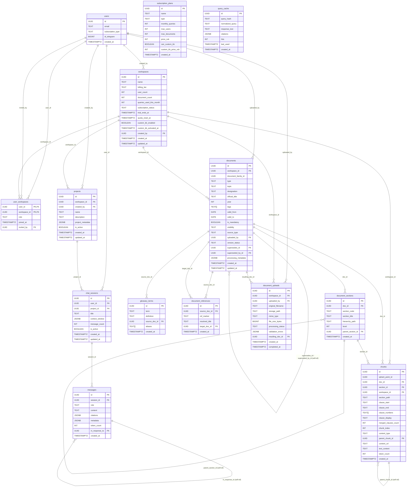

# 🏗️ AI-Assistant for Regulatory Documents: RAG Knowledge Base Pipeline

## 📋 Описание проекта
AI-ассистент для инженеров-проектировщиков и архитекторов — интеллектуальный поиск информации в нормативной документации (СП). Ассистент использует гибридный поиск (векторный + полнотекстовый) для предоставления точных ответов на основе базы знаний, сокращая время поиска нормативных требований с 30 минут до 1-2 минут.
Ключевая бизнес-ценность: автоматизация поиска по нормативной документации с учетом контекста, версионности документов и изоляции данных для B2B-клиентов.
Целевая аудитория:
•	B2C: индивидуальные пользователи с подпиской Free/Pro, доступ к публичным документам
•	B2B: проектные компании (200+ сотрудников), доступ к публичной + приватной базе знаний (внутренние стандарты, шаблоны, архив проектов)

---

## 🎯 Задачи проекта (DE-часть)
1.	Разработать ETL-пайплайн обработки документов: обеспечить конвертацию PDF → Markdown → очистку → извлечение метаданных → чанкинг → векторизацию → загрузку в хранилища в едином воспроизводимом сценарии.
2.	Подобрать и обосновать архитектуру хранения данных: выбрать оптимальные решения для реляционных данных (метаданные, пользователи, сессии) и векторных представлений (эмбеддинги) с учетом требований к масштабируемости, безопасности и стоимости.
3.	Спроектировать SQL-схему и политики доступа с учетом будущих изменений: заложить поддержку версионности документов, B2B-мультитенантность (workspaces, роли пользователей), а также Future Features (проекты, контекстные диалоги, self-service загрузку).
4. Реализовать специализированный чанкинг нормативных текстов: обеспечить разбиение по пунктам документа с сохранением номеров (clause_numbers), отдельную обработку таблиц и контроль числа токенов; при отсутствии нумерованных пунктов использовать RecursiveCharacterTextSplitter с настройкой размера чанков в токенах, перекрытия и разделителей.
5.	Добавить эксплуатационный контур: обеспечить контейнеризацию, шаблон окружения, логирование и unit-тесты критической логики.

---

## 🏗️ Архитектура решения
**Гибридное хранилище:**
•	Supabase (PostgreSQL): метаданные документов, секций, чанков; пользователи, workspaces, подписки; сессии и сообщения
•	Qdrant: векторные представления чанков (хранение в коллекциях)

**Пайплайн обработки:**
```
PDF → Markdown → Очистка → JSON (метаданные) → Chunking → Embeddings → Supabase + Qdrant
```

**Схема метаданных:**

---

## 🛠️ Технологический стек

- Реляционное хранилище: Supabase (PostgreSQL 15+)
- Векторное хранилище: Qdrant (Docker Compose)
- Оркестрация: Ручной запуск (run_full_pipeline.py)
- Источник данных: Локальная файловая система (PDF)
- Промежуточные форматы: Markdown, JSON
- Архитектура: Гибридная (реляционная + векторная), RLS, версионность
- Языки: SQL, Python
- Конвертация PDF: Docling, pypdf
- Обработка текста: Regex, langchain-text-splitters
- Векторизация: sentence-transformers, ai-forever/ru-en-RoSBERTa
- Индексация: GIN (триграммы, массивы), B-tree
- Загрузка данных: Supabase client, Qdrant client (batch upsert)
- Тестирование: pytest
- Контейнеризация: Docker, Docker Compose
- Логирование: Python logging

---

## 🧪 Результаты работы

### 📄 ETL Pipeline: Building a RAG Knowledge Base from Regulatory PDFs
Построили полный pipeline подготовки базы знаний из нормативных PDF-документов: объединили конвертацию, очистку, выделение структуры, чанкование и загрузку данных в хранилища в едином сценарии.
**Стек:** Python, Supabase Python client, Qdrant client.
**Ценность:** опыт разработки воспроизводимого ETL-процесса для AI/RAG-систем с поддержкой версионности документов и B2B-мультитенантности.

### 📑 PDF to Markdown Conversion
Реализовали преобразование PDF в Markdown с поддержкой больших документов: для объемных файлов предусмотрели обработку по страницам с последующей сборкой результата.
**Стек:** Docling, pypdf, Python.
**Ценность:** работа с неструктурированными данными и оптимизация ресурсоемкого document processing для нормативной документации со сложной иерархией.

### 🧹 Document Cleaning & Metadata Extraction
Разработали очистку документов и извлечение метаданных: обрабатывали оглавления, переносы слов, служебную разметку и формировали JSON со сведениями о документах и секциях.
**Стек:** Python, регулярные выражения, JSON.
**Ценность:** понимание влияния качества исходных данных на поиск, индексацию и ответы AI-систем; подготовка метаданных

### ✂️ Specialized Chunking for Regulatory Texts
Реализовали специализированный чанкинг нормативных текстов: учитывали иерархию пунктов, ложные границы, табличные блоки, тип содержимого, номера разделов и число токенов.
**Стек:** Python, langchain-text-splitters, tokenizer embedding-модели (ai-forever/ru-en-RoSBERTa).
**Ценность:** создание предметной логики разбиения данных вместо универсального split-by-length подхода.

### 🔢 Embeddings for Semantic Search
Сформировали embeddings для семантического поиска: преобразовывали чанки документов в векторные представления для дальнейшего retrieval по смысловой близости.
**Стек:** sentence-transformers, модель ai-forever/ru-en-RoSBERTa.
**Ценность:** практический опыт подготовки данных для vector search и RAG в предметной области нормативной документации.

### 🔄 Coordinated Loading to Supabase & Qdrant
Организовали согласованную загрузку данных в Supabase и Qdrant: документы, секции и текст чанков сохранялись в реляционном хранилище, а векторы загружались в коллекцию sp_chunks с привязкой через идентификаторы чанков.
**Стек:** Supabase Python client, Qdrant client, batch upsert.
**Ценность:** интеграция relational и vector databases, синхронизация данных через единый идентификатор, поддержка гибридного поиска (векторный + полнотекстовый через GIN триграммы).

### 🗄️ SQL Schema & RLS Policies for AI Service
Спроектировали SQL-схему и политики доступа для AI-сервиса: создали модели документов, секций, чанков, пользователей, рабочих пространств, сессий и сообщений, добавили индексы, функции и Row Level Security.
**Стек:** PostgreSQL / Supabase SQL, JSONB, GIN-индексы (триграммы, массивы), RLS, pgcrypto, pg_trgm.
**Ценность:** навыки data modeling (с учетом Future Features из ТЗ: версионность, B2B, проекты, контекстные диалоги), безопасности доступа (RLS с функциями user_has_workspace_access, get_user_workspaces) и подготовки данных для взаимодействия DE- и DS-компонентов.

### 🐳 Operational & Testing Pipeline
Добавили эксплуатационный и проверочный контур pipeline: настроили запуск Qdrant через Docker Compose, шаблон окружения, логирование и коды завершения оркестратора, а также unit-тесты парсинга и чанкинга с mock embedder.
**Стек:** Docker Compose, Qdrant, Python logging, pytest.
**Ценность:** опыт поддержки data pipeline, диагностики интеграций (Supabase ↔ Qdrant), тестирования критической логики изоляции данных и воспроизводимости ETL-процесса.

---

## 🏷️ Теги
#etl #llm #rag #supabase #qdrant #python #document-processing #vector-database #nlp #data-modeling #rls #postgresql #docker #regulatory-ai #technical-documents #sentence-transformers #pytest #data-engineering


# Структура проекта

```text
Team_DE/
├── .env                                # Секреты (пароли, ключи)
├── .gitignore                          # Игнорируем .env и данные
├── requirements.txt                    # Python зависимости
├── README.md                           # Инструкция
├── run_full_pipeline.py                # Оркестратор полного пайплайна
│
├── sql/                                # SQL скрипты для Supabase
│   └── 01_create_tables.sql            # DDL файл (создание схемы, таблиц, триггеры, функции, политики)
│
├── scripts/                            # DE скрипты
│   ├── 01_pdf_to_markdown.py           # Конвертация PDF → Markdown
│   ├── 02_clean_markdown.py            # Очистка документа от мусора, извлечение метаданных для Supabase
│   ├── 03_supabase_writer.py           # Вставка метаданных из json в documents и document_sections
│   ├── 04_chunking.py                  # Чанкование секций, извлечение метаданных для Supabase chunks
│   ├── 05_embedding.py                 # Эмбеддинг чанков
│   ├── 06_upsert_chunks_supb.py        # Загрузка метаданных в Supabase и векторов в Qdrant
│   ├── 07_insert_to_qdrant.py          # Вставка векторов в Qdrant
│   ├── qdrant_helper                   # Подключение к векторной БД
│   └── supbase_helper                  # Подключение к Supabase
│
│
├── tests/                              # Unit-тесты
│   └── test_sp_parser.py
│
├── data/                               # Входные данные
│   └── pdfs/                           # Папка с PDF документами
│       ├── SP 1.13130.2020.pdf
│       └── ...
│
└── output/                             # Промежуточные выходные данные
    ├── markdown/                       # Конвертированные Markdown файлы
    │   └── SP 1.13130.2020.md
    ├── cleaned/                        # Очищенные Markdown файлы
    │   └── СП_1.13130.2020.md
    └── json/                           # JSON структуры метаданных
        └── СП_1.13130.2020.json

```

# Предварительные требования

**ВМ:** Сервер с Linux (например, Ubuntu 20.04/22.04).

**Доступ:** SSH-доступ к ВМ. Ваш пользователь должен быть в группе docker (обычно настраивается администратором).

**Сервисы:** Аккаунт и проект в Supabase для облачной БД.

---

## Шаг 1: Подключение к ВМ и установка зависимостей ОС

Подключитесь к вашей ВМ по SSH и выполните начальную настройку.

```
# 1. Подключение
ssh ваш_пользователь@<IP_АДРЕС_ВМ>

# 2. Обновление пакетов
sudo apt update && sudo apt upgrade -y

# 3. Установка Python, pip, git и сетевых утилит
sudo apt install -y python3 python3-pip python3-venv git net-tools curl
```

---

## Шаг 2: Клонирование репозитория и настройка переменных окружения

```
# 1. Клонируйте ваш проект (замените URL на реальный)
git clone <URL_ВАШЕГО_РЕПОЗИТОРИЯ> svodpro
cd svodpro

# 2. Создайте виртуальное окружение Python и активируйте его
python3 -m venv venv
source venv/bin/activate

# 3. Установите Python-зависимости
pip install -r requirements.txt
```

Теперь создайте и заполните файл `.env` в корне проекта (`svodpro/.env`). Это самый важный шаг конфигурации.

```
nano .env
```

Скопируйте и заполните содержимое. Возьмите `SUPABASE_URL` и `SUPABASE_PRIVATE_KEY_LONG` из настроек вашего проекта в Supabase (Settings -> API -> Project URL и service_role key).

```
# .env
SUPABASE_URL=https://ваш-проект.supabase.co
SUPABASE_PRIVATE_KEY_LONG=eyJhbGciOiJI...ваш-длинный-ключ

QDRANT_HOST=localhost
QDRANT_PORT=6333
QDRANT_API_KEY=
```


---

## Шаг 3: Настройка облачной базы данных (Supabase)

Выполните этот шаг один раз для инициализации схемы базы данных.

1. Войдите в Supabase Dashboard вашего проекта.
2. Перейдите в **SQL Editor**.
3. Откройте файл `sql/01_create_tables.sql` из вашего проекта локально и скопируйте его полное содержимое.
4. Вставьте скрипт в редактор Supabase и нажмите **Run**.
5. Дождитесь успешного выполнения. Вы увидите сообщение *"Success. No rows returned"*. Все таблицы, индексы и политики будут созданы.

---

## Шаг 4: Установка Docker и запуск Qdrant

Следуйте подпроцессу для установки Docker, если он еще не настроен на ВМ.

### 4.1. Установка Docker Engine

```
# Установите необходимые пакеты для добавления репозитория Docker
sudo apt-get install ca-certificates curl
sudo install -m 0755 -d /etc/apt/keyrings
sudo curl -fsSL https://download.docker.com/linux/ubuntu/gpg -o /etc/apt/keyrings/docker.asc
sudo chmod a+r /etc/apt/keyrings/docker.asc

# Добавьте репозиторий в источники Apt
echo \
  "deb [arch=$(dpkg --print-architecture) signed-by=/etc/apt/keyrings/docker.asc] https://download.docker.com/linux/ubuntu \
  $(. /etc/os-release && echo "$VERSION_CODENAME") stable" | \
  sudo tee /etc/apt/sources.list.d/docker.list > /dev/null
sudo apt-get update

# Установите Docker Engine, CLI, containerd и плагин Docker Compose
sudo apt-get install -y docker-ce docker-ce-cli containerd.io docker-buildx-plugin docker-compose-plugin

# Добавьте вашего пользователя в группу docker, чтобы не использовать sudo
sudo usermod -aG docker $USER
```

> **Важно:** После добавления в группу `docker` нужно перезайти в сессию (выйти и зайти по SSH) или выполнить `newgrp docker`.

### 4.2. Запуск Qdrant

В проекте уже есть готовый `docker-compose.yml` файл. Запустите им контейнер.

```
# Находясь в корневой папке проекта, запустите Qdrant в фоне
docker compose up -d
```

**Проверка работы:**

```
# Проверка, что контейнер работает
docker ps

# Проверка HTTP API Qdrant
curl http://localhost:6333
```

В ответ вы должны получить JSON с версией Qdrant.

---

## Шаг 5: Подготовка данных и полный запуск пайплайна

Перед запуском убедитесь, что выполнены все предыдущие шаги: активировано виртуальное окружение, Qdrant запущен, Supabase настроен.

### 5.1. Размещение PDF-файлов

Поместите ваши PDF-файлы нормативных документов в папку `data/pdfs/`.

```
# Пример копирования файлов в нужную папку
cp /путь/к/вашим/*.pdf data/pdfs/
```

### 5.2. Запуск главного оркестратора

Теперь запустите `run_full_pipeline.py`. Он последовательно выполнит все шаги, от конвертации PDF до загрузки данных в Supabase и Qdrant.

```
python run_full_pipeline.py
```

**Что будет происходить по шагам (как задумано в скрипте):**

1. Переводит документы из PDF в Markdown. Логика описана в скрипте 01_pdf_to_markdown.py
2. Очищает Markdown от мусора. Логика описана в скрипте 02_clean_markdown.py
3. Добавляет документы в таблицу documents в Supabase и пункты секций в таблицу document_sections в Supabase. А также добавляет JSON в папку output/json/. Логика описана в скрипте 03_supabase_writer.py
4. Разбивает документы на чанки с помощью класса SPDocumentChunker.
5. Вставляет чанки в таблицу chunks в Supabase с помощью класса SupabaseChunksUpserter.
6. Вставляет векторные представления чанков в коллекцию sp_chunks в Qdrant с помощью класса QdrantInsertor.

### 5.3. Валидация (как проверить, что все работает)

**Supabase:** Зайдите в Supabase Dashboard -> Table Editor.

- Проверьте таблицы `documents`, `document_sections` и `chunks`. В них должны появиться записи.

**Qdrant:** Выполните API-запрос к коллекции.

```
curl http://localhost:6333/collections/sp_chunks
```

Если коллекция существует и количество векторов (`vectors_count`) больше 0, значит, загрузка прошла успешно.

---

## Заключение и полезные команды

Проект развернут и успешно отработал.

**Управление Qdrant:**

- Остановить: `docker compose stop`
- Запустить: `docker compose start`
- Посмотреть логи: `docker compose logs -f`

**Повторный запуск пайплайна:** Просто снова активируйте виртуальное окружение (`source venv/bin/activate`) и запускайте `python run_full_pipeline.py`. Скрипты upsert (обновляют или вставляют) безопасно обновят данные в Supabase и Qdrant для тех же документов.
```
