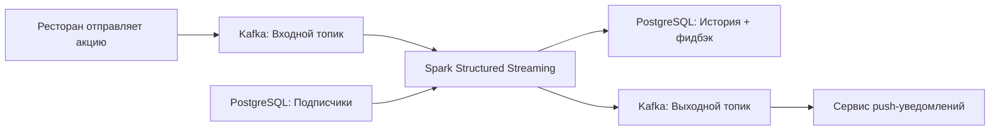

Конечно! Вот обновлённая версия без указанных разделов:

---

# 🚀 Spark Streaming: Restaurant Campaign Notification Service  
**Потоковый сервис на PySpark для уведомления подписчиков ресторанов об акциях в реальном времени**

---

## 🎯 Описание проекта  
В рамках развития агрегатора доставки еды внедрена новая функция — **подписка на рестораны**. Пользователи могут добавлять любимые заведения в избранное и получать уведомления об акциях с ограниченным сроком действия.  

Этот проект представляет собой **стриминговое приложение на Apache Spark**, которое:  
- Читает акции ресторанов из Kafka  
- Находит подписчиков этих ресторанов в PostgreSQL  
- Формирует и отправляет персонализированные уведомления в Kafka для дальнейшей рассылки  
- Сохраняет историю отправок в PostgreSQL для сбора фидбэка  

**Цель:** автоматизировать таргетированную рассылку акций только тем пользователям, которые добавили ресторан в избранное, в период действия акции.

---

## 📡 Архитектура решения  



---

## 🛠 Технологический стек  
- **Обработка данных:** Apache Spark (Structured Streaming)  
- **Источники данных:** Kafka, PostgreSQL  
- **Язык:** Python (PySpark)  
- **Протоколы:** SASL_SSL, SCRAM-SHA-512  
- **Формат данных:** JSON  
- **Оркестрация:** Spark Streaming Jobs  
- **Базы данных:** PostgreSQL (Docker)  

---

## 📊 Ключевые компоненты  

### 1. **Входные данные (Kafka)**  
Сообщение от ресторана содержит:  
```json
{
  "restaurant_id": "uuid",
  "adv_campaign_id": "uuid",
  "adv_campaign_content": "текст акции",
  "adv_campaign_owner": "Иван Иванов",
  "adv_campaign_owner_contact": "email",
  "adv_campaign_datetime_start": 1659203516,
  "adv_campaign_datetime_end": 2659207116,
  "datetime_created": 1659131516
}
```

### 2. **Подписчики (PostgreSQL)**  
Таблица `subscribers_restaurants`:  
- `client_id` — UUID пользователя  
- `restaurant_id` — UUID ресторана  

### 3. **Выходные данные**  
- **В Kafka** — JSON для push-уведомлений (без поля `feedback`)  
- **В PostgreSQL** — полная запись с пустым полем `feedback` для последующего заполнения  

---

## 🔧 Реализованные функции  

### ✅ Чтение акций из Kafka  
- Подключение к защищённому кластеру Kafka (SASL_SSL + SCRAM-SHA-512)  
- Десериализация JSON в структурированный датафрейм  

### ✅ Фильтрация по времени действия акции  
- Только актуальные акции (текущее время между `start` и `end`)  

### ✅ Загрузка подписчиков из PostgreSQL  
- Статическое чтение таблицы подписчиков  

### ✅ Объединение данных (JOIN)  
- Соединение потоковых данных (акции) со статическими (подписчики) по `restaurant_id`  

### ✅ Двойная запись результатов  
- **В PostgreSQL** — для аналитики и сбора фидбэка  
- **В Kafka** — для отправки в сервис уведомлений  

### ✅ Оптимизация памяти  
- Персистентность датафрейма между операциями записи  
- Очистка памяти после обработки  

---

## 🧪 Ключевые особенности реализации  

- **Использование `foreachBatch`** — для записи в несколько целевых систем  
- **Сериализация/десериализация JSON** — через встроенные функции Spark  
- **Таймзона UTC** — единое время для всех временных меток  
- **Безопасное подключение** — SSL и аутентификация SCRAM для Kafka  
- **Управление памятью** — `persist()`/`unpersist()` для оптимизации  

---

## 📈 Результаты проекта  

✅ **Реализован end-to-end стриминговый пайплайн** обработки данных в реальном времени  
✅ **Интеграция двух источников** (Kafka + PostgreSQL) в единый поток  
✅ **Двойная запись результатов** — для уведомлений и аналитики  
✅ **Фильтрация по времени** — отправка только актуальных акций  
✅ **Готовое решение** для таргетированных рекламных рассылок подписчикам  

---

## 🏷️ Теги  
`#spark` `#spark-streaming` `#kafka` `#postgresql` `#pyspark` `#etl` `#real-time` `#notification-system` `#data-engineering` `#sasl-ssl` `#json` `#docker` `#restaurant-tech`

---